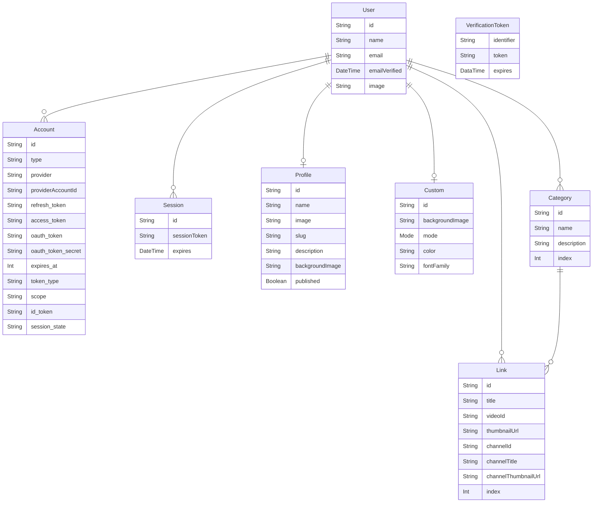

<h1 style="text-align: center;">FAVOLINK</h1>

<!--  -->
<!--  -->

  
  

## URL

**https://favolink.vercel.app/**

## 概要

好きな動画で自己紹介できるプロフィールアプリ。

## 作成した動機

あらゆる SNS アカウントをまとめたり、趣味や好きなものを列挙するプロフィールアプリはいろいろと存在するものの、自分の好きな動画を紹介することで、自分をアピールするサービスは無いように感じていた。

## 既存のサービスでは解決できないこと

- たとえ好きな動画を投稿しようとも、すぐに過去へ流れていってしまう。
- プロフィール欄に好きな動画を記載しても、再生ページへアクセスしてもらわなければならないというハードルがある。

## このアプリで解決できること

- 登録した動画はプロフィールページに残り続ける。
- 再生ページへアクセスする必要はなく、プロフィールページ内で動画を再生できる。

## ページと機能

|                          トップページ                          |                             ログイン                             |
| :------------------------------------------------------------: | :--------------------------------------------------------------: |
|  |  |
|                 アプリの概要を画像付きで紹介。                 |                      Google、Twitter 認証。                      |

 

|                                                                                  ダッシュボード                                                                                  |                                                                         プロフィール編集ページ                                                                          |
| :------------------------------------------------------------------------------------------------------------------------------------------------------------------------------: | :---------------------------------------------------------------------------------------------------------------------------------------------------------------------: |
|                                                                                                              |                                                                                                       |
| ダッシュボードにはプロフィール編集、動画登録、カスタマイズを行うページと、プレビューページが存在する。サイドバーには各種ページへのリンク、右枠にはそれぞれのページが表示される。 | プロフィール編集ページでは、アバター画像のアップロード、表示名、公開ページの slug、登録した動画に対する説明文、プロフィールページの公開非公開の設定を行うことができる。 |

 

|                         動画リスト編集ページ（登録）                         |                      動画リスト編集ページ（並び替え）                       |
| :--------------------------------------------------------------------------: | :-------------------------------------------------------------------------: |
|  |  |
|      ネストしたフォームを動的に生成し、カテゴリー名と動画の登録を行う。      |                      要素の並び替え、アコーディオン。                       |

 

|                      カスタマイズページ（モード変更）                      |                    カスタマイズページ（画像アップロード）                    |
| :------------------------------------------------------------------------: | :--------------------------------------------------------------------------: |
|  |  |
|                   公開ページ用の背景画像とモードの設定。                   |                           背景画像のアップロード。                           |

|                                           プレビューページ                                           |                                  公開ページ                                  |
| :--------------------------------------------------------------------------------------------------: | :--------------------------------------------------------------------------: |
|                                    |             |
| 公開前の状態を確認できるプレビューページ。サムネイルをクリックすると、ダイアログで動画を再生できる。 | 自身の公開ページを開いた場合にのみ、右上に編集ページへのボタンが表示される。 |

## 使用技術

- Next.js 13.2.1
- React 18.2.0
- TypeScript 4.9.5

#### 認証

- NextAuth.js
- GCP OAuth 2.0
- Twitter API

#### データ取得、グローバルステート管理

- axios
- Tanstack Query
- react-error-boundary

#### フォームの生成、バリデーション

- React Hook Form
- zod

#### Style、UI、アニメーション

- Tailwind CSS
- Headless UI
- clsx
- Framer Motion
- react-hot-toast
- react-icons

#### 動画情報の取得、再生

- YouTube Data API v3
- react-player

#### インフラ、DB 関連

- Vercel
- Prisma
- PlanetScale
- Cloud Storage for Firebase

## ER 図

