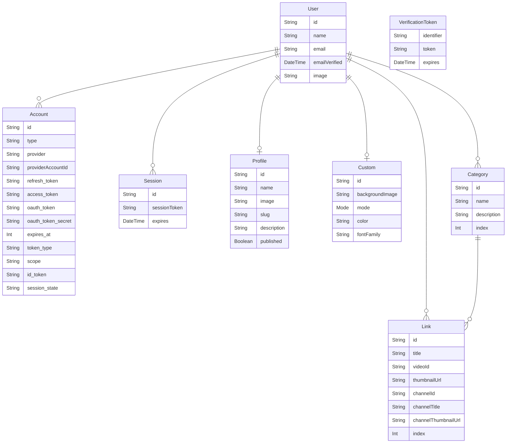

<h1 align="center">FAVOLINK</h1>

<!--  -->
<!--  -->

  
  &nbsp;
  
  &nbsp;
  

## URL

**https://favolink.vercel.app/**

## FAVOLINK に関して

### 概要

好きな動画で自己紹介できるプロフィールアプリ。

### 作成した動機・目的

あらゆる SNS アカウントをまとめたり、趣味や好きなものを列挙するプロフィールアプリは、現状でも多く存在する。 
しかし、好きな動画を紹介することで、自分をアピールするサービスは無いように感じていた。

### 既存のサービスでは解決できないこと

- プロフィール欄に好きな動画を記載したとしても、再生ページへアクセスしてもらわなければならないというハードルが存在する。
- 好きな動画を紹介する投稿をしたとしても、すぐに他の投稿に埋もれ、過去へと流れていってしまう。

### このアプリで解決できること

- プロフィールページから再生ページへアクセスしてもらう必要はなく、その場で動画を再生することができる。
- 投稿とは異なり、登録した動画はプロフィールページに残り続ける。

## ページと機能

<!-- prettier-ignore -->
| トップページ・ログイン | ダッシュボード |
| :---: | :---: |
|  |  |
| Google、Twitter、ゲストアカウントによる認証。 ※ 2023/4/30現在、Twitter認証を一時的に停止しています。 | サイドバーには各種編集ページへのリンク、右枠にはそれぞれのページが表示される。 |

 

<!-- prettier-ignore -->
| プロフィール編集ページ | カスタマイズページ |
| :---: | :---: |
|  |  |
| 各種プロフィール情報と、プロフィールページの公開状態を変更できる。 | プロフィールページの背景画像のアップロードと、ライト・ダークモードの変更ができる。 |

 

<!-- prettier-ignore -->
| 動画リスト編集ページ（登録） | 動画リスト編集ページ（並び替え） |
| :---: | :---: |
|  |  |
| ネストしたフォームを動的に生成し、カテゴリー名と動画の登録を行う。 | 要素を並び替え、プロフィールページでの表示順を変更できる。 |

 

<!-- prettier-ignore -->
| プレビューページ | 公開ページ |
| :---: | :---: |
|  |  |
| 公開前の状態を確認できる。サムネイルをクリックすると、ダイアログで動画を再生する。 | 自身のプロフィールページを開いた場合にのみ、右上に編集ページへのボタンが表示される。 |

## 使用技術

- Next.js 13.2.1
- React 18.2.0
- TypeScript 4.9.5

#### 認証

- NextAuth.js
- GCP OAuth 2.0
- Twitter API

#### データ取得、グローバルステート管理

- axios
- Tanstack Query
- react-error-boundary

#### フォームの生成、バリデーション

- React Hook Form
- zod

#### Style、UI、アニメーション

- Tailwind CSS
- Headless UI
- clsx
- Framer Motion
- react-hot-toast
- react-icons

#### 動画情報の取得、再生

- YouTube Data API v3
- react-player

#### インフラ、DB 関連

- Vercel
- Prisma
- PlanetScale
- Cloud Storage for Firebase

## ER 図

